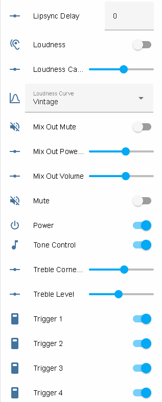
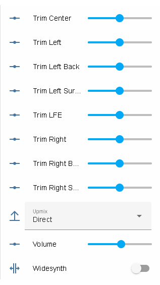
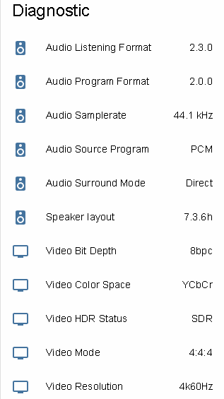
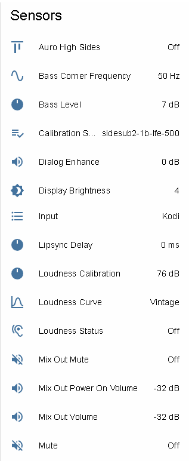

## Home Assistant integration for the Monoprice Monolith HTP-1

This repo provides [Home
Assistant](https://www.home-assistant.io/) integration for the [Monoprice
HTP-1](https://www.monoprice.com/product?p_id=37887) home theater processor.

## Installation

Copy the `monoprice_htp1` directory from the .zip file into a directory named `custom_components`
under your Home Assistant's configuration directory and restart Home Assistant.

Install via Integrations: add Integration and search for Monoprice.

Input your HTP-1 IP-address and after about 10 seconds sensors should appear and update.

## Screens

 

 

