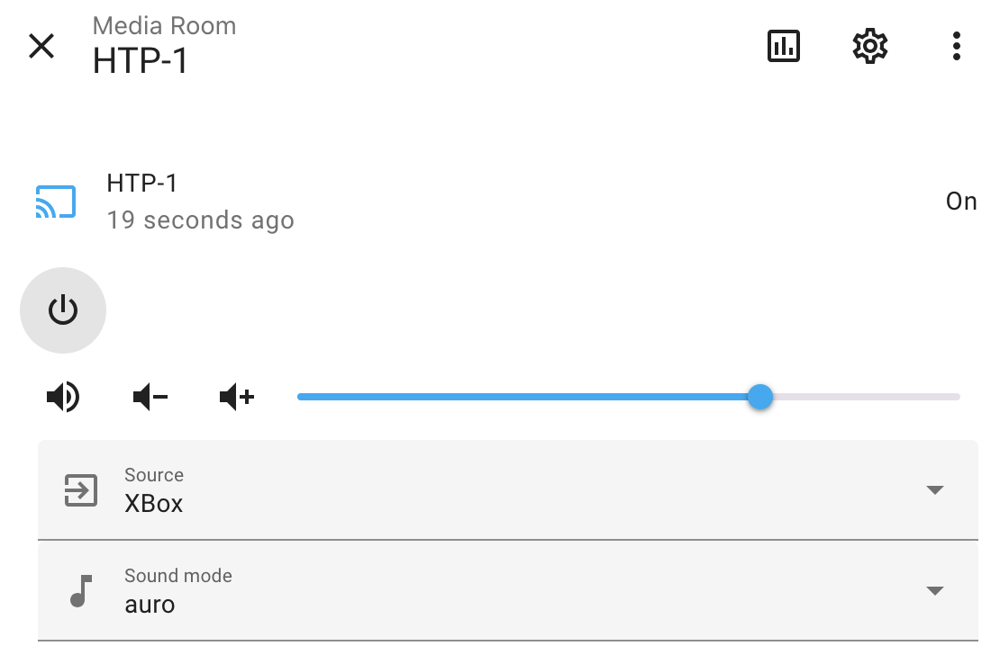

## Home Assistant integration for the Monoprice HTP-1

This repo provides an alpha quality [Home
Assistant](https://www.home-assistant.io/) integration for the [Monoprice
HTP-1](https://www.monoprice.com/product?p_id=37887) home theater processor. It
currently provides access to the device power state, volume, source, and upmix
(mode.)

It was created mainly to allow automation of a projection screen and lighting
in the room based on the device's power state and it has served that purpose
well. Less frequently it's been used to modify the volume, source, and upmix
all of which work seamlessly.

The integration has been in use for roughly 8 months as of 2025-06. The only
known issue is that the component will sometimes lose the ability to talk to
the device after a month or two have elapsed or if the device has been fully
powered down for a while. When this happens reloading the integration is
sufficent to get things working.

## Installation

Copy the monoprice_htp1 directory into a directory named `custom_components/`
under you Home Assistant configuration directory and restart HA.

## State

As stated above this code is functional without any major issues, but there are
no garuntees made about its use. PRs are welcome, but at this point there are
no specific plans to add functionality or make changes to the code here.
Questions are welcome in the form of issues, but no promises are made regarding
responses timeliness or quality.
