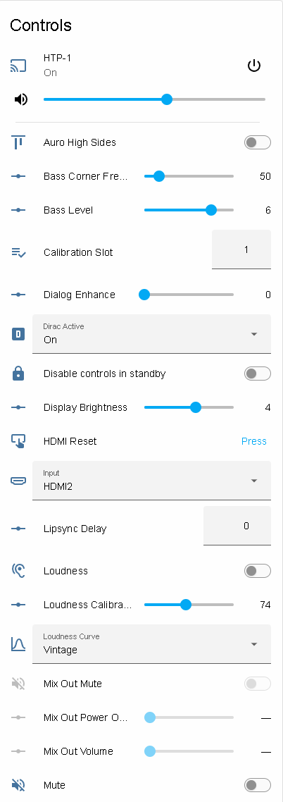
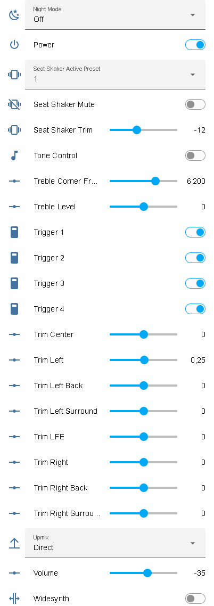
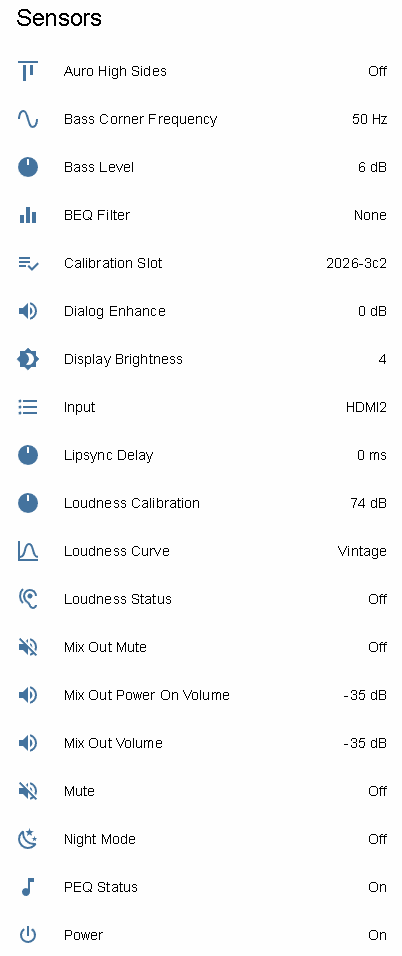
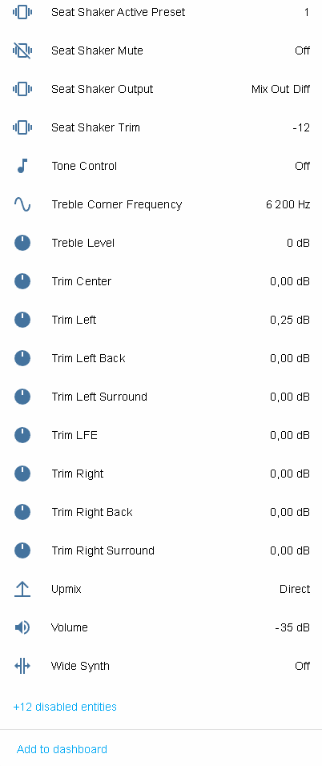
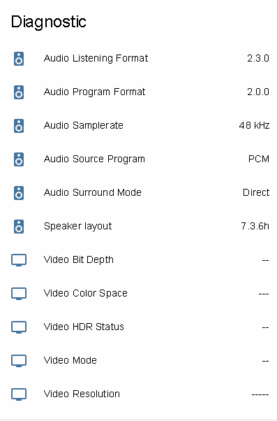
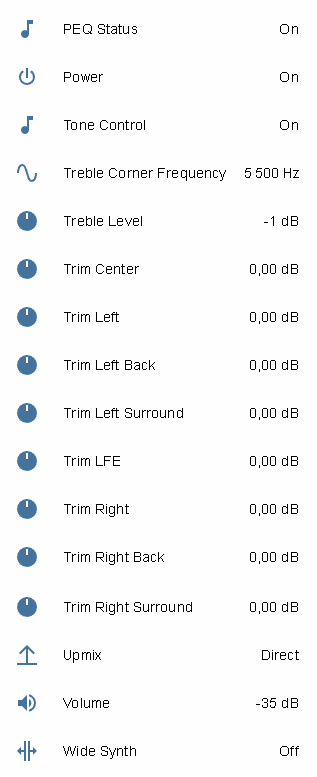

## Home Assistant integration for the Monoprice Monolith HTP-1

This repo provides [Home
Assistant](https://www.home-assistant.io/) integration for the [Monoprice
HTP-1](https://www.monoprice.com/product?p_id=37887) home theater processor.

## Installation

### HACS (recommended)

1. Make sure [HACS](https://hacs.xyz/) is installed in your Home Assistant instance.
2. In Home Assistant, go to **HACS → Integrations → ⋮ → Custom repositories**.
3. Add `https://github.com/TimoJJ/ha-monolith-htp1` as the repository URL, with category **Integration**.
4. Find "Monoprice HTP-1" in HACS and click **Download**.
5. Restart Home Assistant.
6. Go to **Settings → Devices & Services → Add Integration**, search for "Monoprice", and follow the config flow, entering your HTP-1's IP address.

### Manual installation (alternative)

Copy the `monoprice_htp1` directory from a downloaded release .zip into the `custom_components` directory under your Home Assistant configuration directory, and restart Home Assistant. Then follow step 6 above to add the integration via the UI.

Input your HTP-1 IP-address and after about 10-15 seconds sensors should appear and update.

## Updating

**Via HACS:** HACS will show an update notification when a new version is released; click **Update**, then restart Home Assistant.

**Manual:** Delete the old `custom_components/monoprice_htp1` directory, copy the new `custom_components/monoprice_htp1` folder from the updated release .zip into `custom_components`, and restart Home Assistant.

## Screens

 

 

 

## Credits

https://github.com/ross/ha-monoprice-htp1 — used as a starting point.

